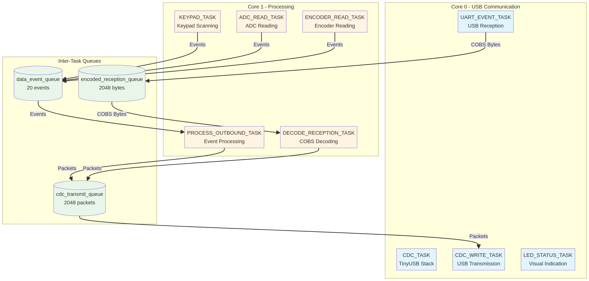
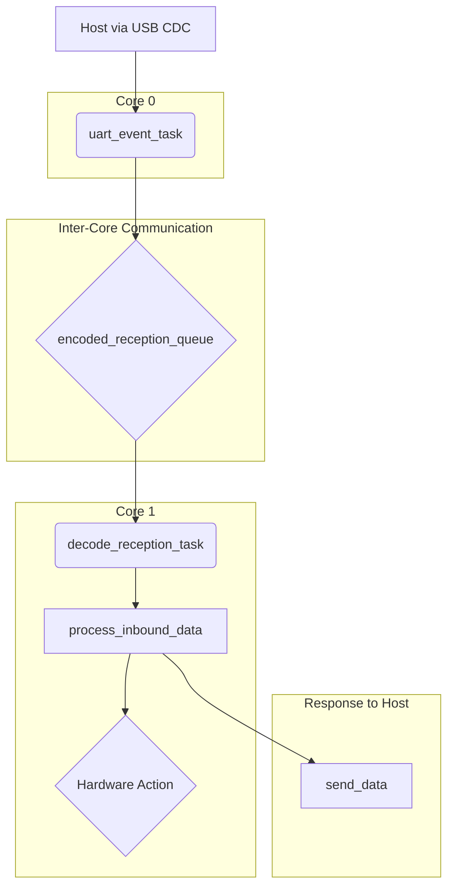
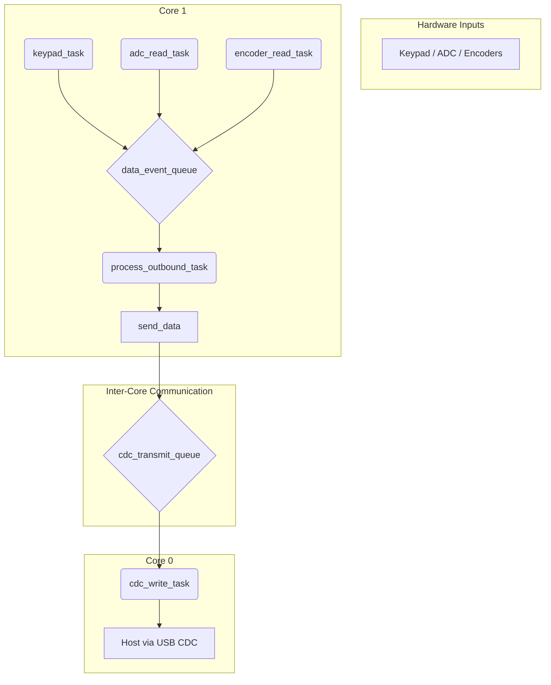

# Architecture Documentation: Signalbridge Controller

**Author**: Manus AI
**Date**: November 21, 2025

## 1. Introduction

This document provides a detailed analysis of the **Signalbridge Controller** firmware's software architecture, with a focus on the task and queue structure implemented on top of FreeRTOS. The objective is to document the interactions between components, the data flow, and to propose architectural improvements to optimize the system's performance, robustness, and maintainability.

The Signalbridge Controller is a real-time firmware for the Raspberry Pi Pico platform, designed to act as a low-latency interface between a host (via USB) and various hardware peripherals, such as keypads, displays, and sensors.

## 2. Architectural Overview

The firmware utilizes **FreeRTOS Symmetric Multi-Processing (SMP)** to manage concurrent tasks on the two **ARM Cortex-M0+** cores of the RP2040 microcontroller. The architecture adopts a **producer-consumer pipeline** pattern, where tasks are strategically distributed between the cores to isolate responsibilities and maximize parallelism.

- **Core 0**: Exclusively dedicated to USB communication tasks (via TinyUSB), ensuring that communication with the host is not affected by processing spikes in other parts of the system.
- **Core 1**: Responsible for data processing, reading hardware inputs (keypad, ADC, encoders), and application logic.

Communication between tasks is handled through **queues**, which act as thread-safe buffers, decoupling data producers from consumers.



*Figure 1: Task and queue architecture of the Signalbridge Controller, showing the distribution between cores and interactions via queues.*

## 3. Task Architecture

The system is composed of nine main tasks, each with a specific responsibility. Core affinity is used to ensure that communication tasks are not interrupted by data processing.

### 3.1. Task Inventory and Distribution

The table below details each task, its execution core, and its assigned priority. All tasks operate at the same base priority (`tskIDLE_PRIORITY + 1`), which simplifies scheduling but can present challenges in high-load scenarios, as discussed in the improvements section.

| Task | Description | Core | Priority |
| :--- | :--- | :--- | :--- |
| `CDC_TASK` | Manages the TinyUSB device stack. | 0 | `+1` |
| `CDC_WRITE_TASK` | Sends data packets from the `cdc_transmit_queue` to the host. | 0 | `+1` |
| `UART_EVENT_TASK` | Reads raw data from the host via USB and enqueues it into the `encoded_reception_queue`. | 0 | `+1` |
| `LED_STATUS_TASK` | Controls the status LED to indicate the system state (e.g., errors, USB connection). | 0 | `+1` |
| `DECODE_RECEPTION_TASK` | Consumes data from the `encoded_reception_queue`, decodes it (COBS), and processes commands. | 1 | `+1` |
| `PROCESS_OUTBOUND_TASK` | Consumes events from the `data_event_queue` and prepares them for sending to the host. | 1 | `+1` |
| `ADC_READ_TASK` | Performs ADC channel readings, applies a moving average filter, and generates events. | 1 | `+1` |
| `KEYPAD_TASK` | Scans the keypad matrix, detects key presses, and generates events. | 1 | `+1` |
| `ENCODER_READ_TASK` | Reads the state of rotary encoders and generates rotation events. | 1 | `+1` |

### 3.2. Memory Allocation (Stack)

Stack sizes are defined in multiples of `configMINIMAL_STACK_SIZE`. Tasks that handle hardware I/O, such as `KEYPAD_TASK` and `ENCODER_READ_TASK`, are allocated larger stacks to accommodate their processing and debouncing needs.

- **Communication and Processing Tasks**: `3 * configMINIMAL_STACK_SIZE`
- **Hardware Tasks (ADC, Keypad, Encoder)**: `4-5 * configMINIMAL_STACK_SIZE`
- **Status Task (LED)**: `2 * configMINIMAL_STACK_SIZE`

## 4. Queue Architecture

Communication and synchronization between tasks are mediated by three main queues, which serve as intermediate buffers for the input and output data streams.

### 4.1. `encoded_reception_queue`

This queue acts as a low-level buffer for raw data received from the host via USB.

- **Purpose**: To store COBS (Consistent Overhead Byte Stuffing) encoded bytes as they arrive.
- **Producer**: `uart_event_task` (Core 0)
- **Consumer**: `decode_reception_task` (Core 1)
- **Size**: 2048 bytes. This size is generous and suitable for absorbing data bursts from the host without loss.
- **Data Type**: `uint8_t`

### 4.2. `data_event_queue`

This is a high-level queue that stores events generated by the hardware input tasks.

- **Purpose**: To decouple hardware event detection from its processing and transmission.
- **Producers**: `keypad_task`, `adc_read_task`, `encoder_read_task` (Core 1)
- **Consumer**: `process_outbound_task` (Core 1)
- **Size**: 20 elements. This size is relatively small and could be a point of contention if there is a burst of hardware events.
- **Data Type**: `data_events_t`

```c
typedef struct data_events_t {
    uint8_t command;                // Command associated with the event (e.g., PC_KEY_CMD)
    uint8_t data_length;            // Size of the event data
    uint8_t data[MAX_DATA_SIZE];    // Event payload (e.g., key code)
} data_events_t;
```

### 4.3. `cdc_transmit_queue`

This queue serves as the final output buffer for all data to be sent to the host.

- **Purpose**: To store fully formatted and encoded data packets, ready for transmission.
- **Producer**: `send_data()` function, which can be called by multiple tasks (mainly `process_outbound_task` and `decode_reception_task`).
- **Consumer**: `cdc_write_task` (Core 0)
- **Size**: 2048 elements. The size is large to ensure that data transmission is smooth.
- **Data Type**: `cdc_packet_t`

```c
typedef struct cdc_packet_t {
    uint8_t length;                           // Size of the encoded packet
    uint8_t data[MAX_ENCODED_BUFFER_SIZE];    // COBS-encoded data packet
} cdc_packet_t;
```

## 5. Data Flow and Interactions

The data flows in the system are clearly defined, separating the reception of commands from the host from the transmission of events from the device.

### 5.1. Reception Flow (Host → Device)

This flow describes how commands sent by the host are received, decoded, and processed.



1.  The `uart_event_task` (Core 0) receives the raw bytes and enqueues them into the `encoded_reception_queue`.
2.  The `decode_reception_task` (Core 1) consumes from the queue, decodes the COBS packet, and validates the checksum.
3.  The `process_inbound_data` function is called to interpret the command.
4.  Depending on the command, a hardware action is performed (e.g., turning on an LED) or a response is sent back to the host through the `send_data()` function.

### 5.2. Transmission Flow (Device → Host)

This flow describes how events generated by the hardware are captured, processed, and sent to the host.



1.  The hardware tasks (`keypad_task`, `adc_read_task`, `encoder_read_task`) on Core 1 monitor the inputs and, upon detecting a state change, generate an event and enqueue it into the `data_event_queue`.
2.  The `process_outbound_task` (Core 1) consumes these events and calls the `send_data()` function.
3.  `send_data()` formats the packet, encodes it in COBS, calculates the checksum, and enqueues it into the `cdc_transmit_queue`.
4.  The `cdc_write_task` (Core 0) consumes the packets from the `cdc_transmit_queue` and sends them to the host via USB.


*Figure 2: Sequence diagram showing the data reception and transmission flows in the system.*

## 6. Synchronization and Data Protection

The Signalbridge Controller architecture uses FreeRTOS synchronization mechanisms to ensure safe communication between tasks.

### 6.1. Synchronization Mechanisms

1.  **FreeRTOS Queues**: All inter-task communications are performed through queues, which are thread-safe by design. This eliminates the need for additional mutexes to protect shared data.
2.  **Core Affinity**: The separation of tasks between the two cores reduces contention and improves performance. USB communication tasks (Core 0) do not compete for CPU time with processing tasks (Core 1).
3.  **Watchdog**: Each task periodically updates the watchdog through the `update_watchdog_safe()` function, ensuring that the system is restarted in case of a hang.

### 6.2. Timeouts and Blocking

Most queue reception operations use `portMAX_DELAY`, which means the task will block indefinitely until an item is available. This is appropriate for event-driven tasks, but can present risks if a queue never receives data.

- **`encoded_reception_queue`**: Send with 5ms timeout. If the queue is full, the error is logged in `QUEUE_SEND_ERROR`.
- **`cdc_transmit_queue`**: Send with 1ms timeout. If the queue is full, the error is logged in `CDC_QUEUE_SEND_ERROR`.
- **`data_event_queue`**: Send with `portMAX_DELAY`. If the queue is full, the producer task will block until there is space.

## 7. Error Management and Diagnostics

The system implements a robust error tracking mechanism, with statistics counters and persistent error states.

### 7.1. Statistics Counters

The firmware tracks 14 types of events and errors, enabling detailed system diagnostics:

| Counter | Description |
| :--- | :--- |
| `QUEUE_SEND_ERROR` | Failures when sending data to queues. |
| `QUEUE_RECEIVE_ERROR` | Failures when receiving data from queues. |
| `CDC_QUEUE_SEND_ERROR` | Failures when sending to the CDC transmission queue. |
| `DISPLAY_OUT_ERROR` | Display driver errors. |
| `LED_OUT_ERROR` | LED driver errors. |
| `WATCHDOG_ERROR` | Missed watchdog updates. |
| `MSG_MALFORMED_ERROR` | Malformed USB messages. |
| `COBS_DECODE_ERROR` | COBS decoding failures. |
| `RECEIVE_BUFFER_OVERFLOW_ERROR` | USB reception buffer overflow. |
| `CHECKSUM_ERROR` | Checksum validation failures. |
| `BUFFER_OVERFLOW_ERROR` | Internal buffer overflow. |
| `UNKNOWN_CMD_ERROR` | Unrecognized commands from the host. |
| `BYTES_SENT` | Total bytes transmitted. |
| `BYTES_RECEIVED` | Total bytes received. |

### 7.2. Persistent Error States

Critical errors are stored in the watchdog's scratch registers, allowing the system to identify the cause of a reset. The status LED blinks in distinct patterns to indicate the error type:

| Error | Blinks | Description |
| :--- | :--- | :--- |
| `ERROR_WATCHDOG_TIMEOUT` | 1 | Watchdog timeout. |
| `ERROR_FREERTOS_STACK` | 2 | FreeRTOS stack overflow. |
| `ERROR_PICO_SDK_PANIC` | 3 | Pico SDK panic. |
| `ERROR_SCHEDULER_FAILED` | 4 | Scheduler startup failure. |
| `ERROR_RESOURCE_ALLOCATION` | 5 | Resource allocation failure. |

## 8. Suggested Architectural Improvements

Based on the analysis of the current architecture, the following improvements are proposed to increase the system's robustness, performance, and maintainability.

### 8.1. Task Prioritization

**Problem**: Currently, all tasks operate at the same priority (`tskIDLE_PRIORITY + 1`). This can lead to latency issues in high-load scenarios, where critical tasks (such as USB communication) may be delayed by data processing tasks.

**Solution**: Implement a hierarchical prioritization scheme:

- **High Priority** (`tskIDLE_PRIORITY + 3`): `CDC_TASK`, `CDC_WRITE_TASK`, `UART_EVENT_TASK`
- **Medium Priority** (`tskIDLE_PRIORITY + 2`): `DECODE_RECEPTION_TASK`, `PROCESS_OUTBOUND_TASK`
- **Low Priority** (`tskIDLE_PRIORITY + 1`): `ADC_READ_TASK`, `KEYPAD_TASK`, `ENCODER_READ_TASK`, `LED_STATUS_TASK`

**Benefit**: Ensures that USB communication takes precedence over data processing, reducing host response latency.

### 8.2. Increase `data_event_queue` Capacity

**Problem**: The `data_event_queue` has a capacity of only 20 events. In burst scenarios (e.g., multiple keys pressed simultaneously or rapid ADC readings), the queue can fill up, causing producer tasks to block.

**Solution**: Increase the queue size to 50 or 100 events.

```c
#define DATA_EVENT_QUEUE_SIZE 50  // Previously 20
```

**Benefit**: Reduces the risk of hardware task blocking and improves system responsiveness.

### 8.3. Replace Polling with Interrupts

**Problem**: The `keypad_task`, `adc_read_task`, and `encoder_read_task` tasks use continuous polling with delays (`vTaskDelay`). This unnecessarily consumes CPU cycles and can increase event detection latency.

**Solution**: Implement interrupt-based reading:

- **Keypad**: Use GPIO interrupts to detect state changes on input lines.
- **ADC**: Configure the ADC to generate interrupts at the end of each conversion.
- **Encoders**: Use edge interrupts to detect rotations.

**Benefit**: Reduces power consumption, frees CPU time for other tasks, and improves event detection latency.

### 8.4. Implement Finite Timeouts

**Problem**: The extensive use of `portMAX_DELAY` in queue reception operations can lead to deadlocks if a queue never receives data (e.g., due to a configuration error).

**Solution**: Replace `portMAX_DELAY` with finite timeouts (e.g., 1000ms) and implement error recovery logic.

```c
if (xQueueReceive(data_event_queue, &data_event, pdMS_TO_TICKS(1000)) == pdTRUE) {
    // Process event
} else {
    // Timeout: log error or take recovery action
    statistics_increment_counter(QUEUE_TIMEOUT_ERROR);
}
```

**Benefit**: Increases system robustness, allowing tasks to detect and recover from abnormal conditions.

### 8.5. Separate Transmission Queue by Data Type

**Problem**: The `cdc_transmit_queue` is shared by all data types (hardware events, command responses, diagnostics). This can lead to prioritization issues, where critical events (e.g., command responses) are delayed by lower-priority events (e.g., ADC readings).

**Solution**: Implement two transmission queues:

- **`cdc_priority_queue`**: For command responses and diagnostics (high priority).
- **`cdc_event_queue`**: For hardware events (low priority).

The `cdc_write_task` should check the `cdc_priority_queue` first before processing the `cdc_event_queue`.

**Benefit**: Ensures that critical commands are processed with low latency, even during hardware event bursts.

### 8.6. Implement Rate Limiting for ADC Events

**Problem**: The `adc_read_task` can generate a large volume of events if ADC values are oscillating rapidly. This can overload the `data_event_queue` and `cdc_transmit_queue`.

**Solution**: Implement rate limiting, sending ADC events only if:

1.  The value has changed significantly (e.g., more than 1% of the previous value).
2.  A minimum time has passed since the last event (e.g., 50ms).

```c
if ((abs(filtered_value - adc_states.adc_previous_value[chan]) > ADC_THRESHOLD) &&
    (time_since_last_event > ADC_MIN_INTERVAL_MS)) {
    adc_generate_event(chan, filtered_value);
    adc_states.adc_previous_value[chan] = filtered_value;
}
```

**Benefit**: Reduces system load and improves USB communication efficiency.

### 8.7. Add Queue Utilization Monitoring

**Problem**: There is no real-time visibility into queue utilization, making it difficult to identify bottlenecks.

**Solution**: Implement a diagnostic command (`PC_QUEUE_STATUS_CMD`) that returns:

- Number of elements currently in the queue.
- Maximum number of elements ever reached (high watermark).
- Number of overflow errors.

```c
uint32_t queue_count = uxQueueMessagesWaiting(data_event_queue);
uint32_t queue_high_watermark = uxQueueSpacesAvailable(data_event_queue);
```

**Benefit**: Enables proactive diagnostics and fine-tuning of queue sizes.

### 8.8. Implement a Memory Pool for Events

**Problem**: Dynamic allocation of `data_events_t` and `cdc_packet_t` structures can lead to heap fragmentation in long-running embedded systems.

**Solution**: Implement a static memory pool for these structures, using controlled allocation and deallocation.

```c
#define EVENT_POOL_SIZE 50
static data_events_t event_pool[EVENT_POOL_SIZE];
static uint8_t event_pool_free_list[EVENT_POOL_SIZE];
```

**Benefit**: Eliminates heap fragmentation and ensures deterministic memory allocation.

### 8.9. Add CRC Checksums Instead of XOR

**Problem**: The XOR checksum is simple, but offers limited protection against transmission errors. Errors that affect two bytes in a complementary manner can go undetected.

**Solution**: Replace the XOR checksum with a CRC-8 or CRC-16, which offers more robust error detection.

```c
uint16_t crc16_calculate(const uint8_t *data, uint8_t length) {
    // CRC-16 implementation (e.g., CRC-16-CCITT)
}
```

**Benefit**: Increases communication reliability, especially in environments with electrical noise.

### 8.10. Document State Diagrams for Complex Tasks

**Problem**: Tasks such as `decode_reception_task` and `encoder_read_task` implement implicit state machines, but there is no formal documentation.

**Solution**: Create UML state diagrams for these tasks and include them in the code documentation.

**Benefit**: Facilitates maintenance and code understanding by new developers.

## 9. Conclusion

The Signalbridge Controller firmware presents a well-structured architecture, with clear separation of responsibilities and effective use of FreeRTOS SMP for task parallelization. The use of queues for inter-task communication ensures safe synchronization and decoupling between data producers and consumers.

However, the analysis revealed opportunities for improvement, especially regarding task prioritization, queue sizing, and replacing polling with interrupts. The suggested improvements aim to increase robustness, reduce latency, and improve the system's energy efficiency.

The implementation of these improvements should be done incrementally, with rigorous testing at each stage to ensure that no regressions are introduced. The addition of diagnostic tools, such as queue utilization monitoring, will facilitate the validation of improvements and the identification of new bottlenecks.

## 10. Summary of Task and Queue Interactions

The table below summarizes the main interactions between tasks and queues in the system:

| Task | Produces to | Consumes from | Core |
| :--- | :--- | :--- | :--- |
| `uart_event_task` | `encoded_reception_queue` | — | 0 |
| `decode_reception_task` | — | `encoded_reception_queue` | 1 |
| `keypad_task` | `data_event_queue` | — | 1 |
| `adc_read_task` | `data_event_queue` | — | 1 |
| `encoder_read_task` | `data_event_queue` | — | 1 |
| `process_outbound_task` | `cdc_transmit_queue` (via `send_data`) | `data_event_queue` | 1 |
| `cdc_write_task` | — | `cdc_transmit_queue` | 0 |
| `cdc_task` | — | — | 0 |
| `led_status_task` | — | — | 0 |

## 11. References

- [FreeRTOS Documentation](https://www.freertos.org/Documentation/RTOS_book.html)
- [Raspberry Pi Pico SDK](https://github.com/raspberrypi/pico-sdk)
- [TinyUSB Documentation](https://docs.tinyusb.org/)
- [COBS Encoding](https://en.wikipedia.org/wiki/Consistent_Overhead_Byte_Stuffing)
- [Signalbridge Controller Repository](https://github.com/carlosmazzei/signalbridge-controller)
