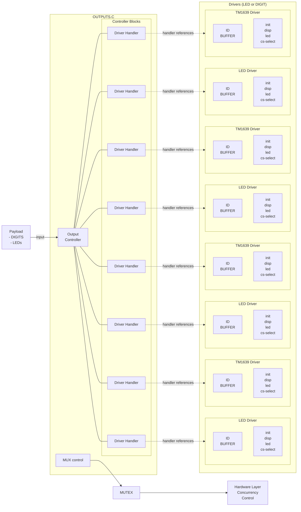

# Output Device Architecture Documentation

## System Overview

This section describes the architecture of the output device control system. The architecture is designed to manage multiple output devices (such as LEDs and digital displays) through a unified interface while allowing for hardware-specific implementations. The system specifically uses SPI bus communication with multiplexed chip selection for efficient hardware control.

## Driver types

These are the driver types supported by the system:

- DEVICE_NONE
- DEVICE_GENERIC_LED
- DEVICE_GENERIC_DIGIT
- DEVICE_TM1639_LED
- DEVICE_TM1639_DIGIT

## Architecture Diagram



## Component Descriptions

### Payload

The payload contains the output data to be displayed, primarily consisting of:

- DIGITS: Numerical display data
- LEDs: Light indicator control data

### OUTPUTS.C

This is the central coordination module of the architecture, containing:

1. **Output Controller**: The multiplexer and input processing unit that handles incoming payload data.

2. **Controller Blocks**: Up to 8 controller blocks, each containing a driver handler. These blocks are responsible for directing data to the appropriate driver. Each controller can only reference one driver at a time.

3. **MUX control**: Manages the physical multiplexer on the SPI bus that selects the appropriate chip select line. This component directly controls which physical device on the SPI bus is active at any given time.

### Driver Handlers

Each controller block contains a driver handler which:

- References exactly one driver instance
- Routes data from the controller to the specific driver
- Translates generic commands into driver-specific operations

### MUTEX

The mutex layer provides hardware-level concurrency control for the SPI bus access. It ensures that:

- Only one controller can access the SPI bus at a time
- Chip select operations are atomic and cannot be interrupted
- The multiplexer state cannot be changed while a transaction is in progress

### Hardware Layer Concurrency Control

This component provides lower-level hardware access control mechanisms, ensuring that hardware resources (particularly the SPI bus and multiplexer) are accessed safely and efficiently.

### Drivers

The architecture supports multiple driver types, including:

1. **LED Drivers**: For controlling LED displays
2. **TM1639 Drivers**: A specific type of driver for digit displays using the TM1639 chipset

Each driver contains:

- **ID BUFFER**: Contains:
  - The controller ID that corresponds to the physical chip select pin number
  - An active buffer with current display state
  - A temporary buffer to prepare updates without causing display flickering

- **Initialization Handlers**: Functions including:
  - init: Initialize the driver and configure its operating parameters
  - disp: Display control functions
  - led: LED control functions
  - cs-select: Pointer to chip select function for implementing device-specific protocols

## Driver Implementation Details

Each driver must implement the following:

1. **digit_out Method**: This method receives a payload and processes it according to the specific protocol required by the hardware device. The method signature typically looks like:

    ```c
    void digit_out(driver_t* driver, payload_t* payload);
    ```

2. **Double Buffering**: Drivers maintain two buffers:
   - Active Buffer: Currently displayed on the hardware
   - Temporary Buffer: Used to prepare the next display state

   This prevents flickering during updates, as the temporary buffer is prepared completely before being atomically swapped with the active buffer.  
3. **Chip Select Mechanism**: Each driver contains a pointer to a chip select function that it can call to implement its specific communication protocol:

    ```c
    typedef void (*cs_select_fn)(uint8_t id, bool state);
    ```

    The driver calls this function to control its chip select line (identified by its ID) during SPI transactions.

## SPI Bus and Multiplexer Control

The SPI bus in this architecture is shared among all output devices, with chip selection managed through a multiplexer:

1. When a controller needs to communicate with its driver:
   - It acquires the MUTEX to gain exclusive access to the SPI bus
   - The MUX control sets the multiplexer to select the appropriate chip select line
   - The driver executes its protocol using the chip select function
   - The MUTEX is released when the transaction is complete

2. The multiplexer allows the system to control up to 8 different chip select lines using fewer GPIO pins, making efficient use of limited microcontroller resources.

## Key Architecture Principles

1. **One-to-One Relationship**: Each controller block references exactly one driver instance, maintaining a clean separation of concerns.

2. **Driver Abstraction**: The architecture allows different driver implementations (LED, TM1639, etc.) to be used interchangeably from the controller's perspective.

3. **Concurrency Control**: The MUTEX and hardware layer concurrency control ensure safe resource sharing on the SPI bus.

4. **Double Buffering**: Prevents display flickering by preparing complete frames before displaying them.

5. **Multiplexed Hardware Access**: Uses a hardware multiplexer to expand the number of controllable devices beyond the available GPIO pins.

6. **Protocol Encapsulation**: Each driver implements its own protocol through the digit_out method, keeping hardware-specific details isolated from the rest of the system.

## Usage Flow

1. Payload data (DIGITS/LEDs) enters the system
2. MP & inputs component processes the data
3. Controller blocks route the data to their respective drivers via handlers
4. Controller acquires the MUTEX for SPI bus access
5. MUX control sets the multiplexer to the appropriate chip select line
6. Driver's digit_out method is called with the payload
7. Driver updates its temporary buffer with the new display state
8. Driver uses the chip select function to implement its protocol over SPI
9. Active and temporary buffers are swapped when the update is complete
10. MUTEX is released, allowing other controllers to access the SPI bus

This architecture provides a flexible framework for controlling various output devices while maintaining clean interfaces, proper resource management, and efficient hardware utilization.
